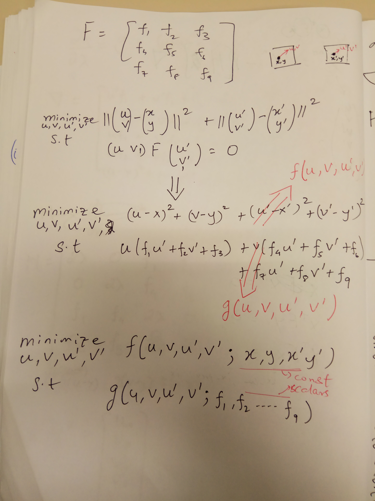
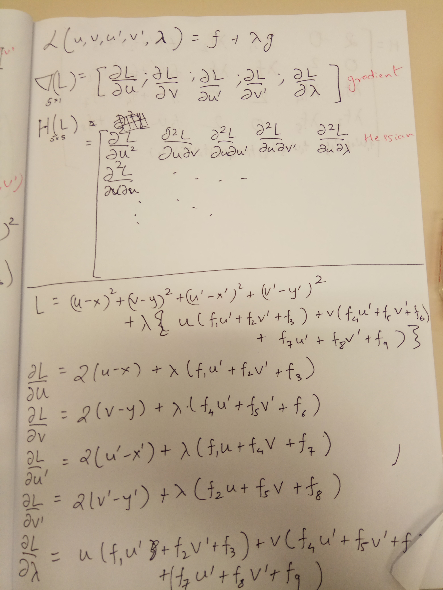
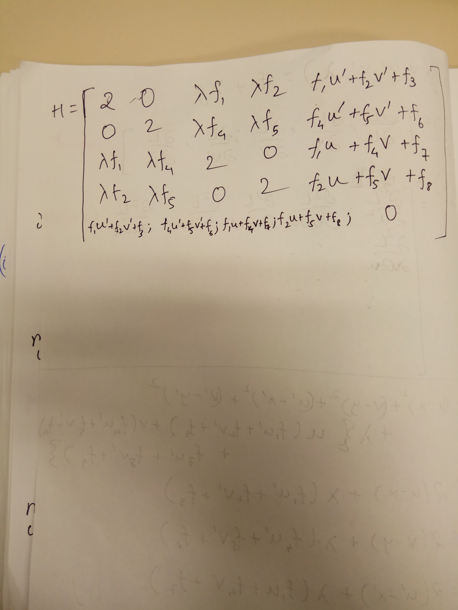

# Optimal Triangulation for Tuning Keypoint Co-ordinates
Given a set of correct keypoint matches and a fundamental matrix, this
script will optimize these keypoints such that they satisfy the epipolar 
constraint. 

## How to run
Simply run `python correct_matches.py`. If you have numpy and opencv correctly setup, should usually work. 

`drag/` contains an opencv XML file containing information on poses of view 530 (530.png) and 532 (532.png). XML file contains the co-ordinates in normalized system and the fundamental matrix. 

## Concept
A point (x,y) on the left image (pose: [I|0]) and (x',y') on the right image (pose: [R|t]). 
These points are undistorted and in normalized image co-ordinates. Having known the pose
already, we can get to the fundamental matrix. F= [t]_x * R. See Hartley-Zizzerman. 

Now we want to get another points (u,v) which is near to (x,y). Also (u',v') which is near
to (x',y') such that these new points (u,v) and (u',v') satisfy the epipolar constraint, ie. (u,v,1) F (u';v';1). 

This can be set up as an optimization problem. Detailed derivation in my note, here. 
Since this optimization problem involves a equality constraint, we can use the Lagrange-multiplier method to arrive at a solution. 
Since the Lagrangian problem is a quadratic and convex cost function, 1 step of Newton's method is sufficient to arrive at an optima. 

## Contact
Manohar Kuse <mpkuse@connect.ust.hk>  
Robotics Institute, HKUST. 

